# Nimivo: Complete Workflow Diagrams

> **Visual Reference for All System Flows**  
> Last Updated: 17 February 2026  
> Purpose: Visualize every critical process in Nimivo platform

---

## Table of Contents

1. [Customer Journey Workflows](#customer-journey-workflows)
2. [Provider Journey Workflows](#provider-journey-workflows)
3. [System Architecture Diagrams](#system-architecture-diagrams)
4. [Payment & Financial Flows](#payment--financial-flows)
5. [Trust & Safety Workflows](#trust--safety-workflows)
6. [Real-Time Communication Flows](#real-time-communication-flows)

---

## Customer Journey Workflows

### 1. Complete Customer Booking Journey

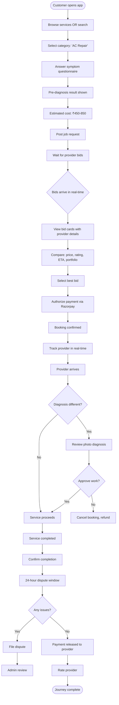

### 2. First-Time Customer Onboarding

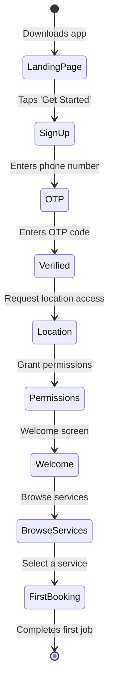

### 3. Repeat Customer Flow

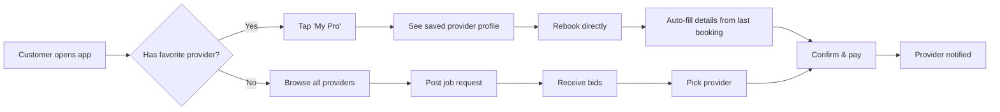

---

## Provider Journey Workflows

### 1. Complete Provider Onboarding

```mermaid
flowchart TD
    Start([Provider hears about Nimivo]) --> Download[Downloads app]
    Download --> SignUp[Sign up with phone number]
    SignUp --> OTP[OTP verification]
    OTP --> Identity[Upload Aadhaar for verification]
    Identity --> Category[Select service categories]
    Category --> Skills[Declare granular skills]
    
    Skills --> Example1["Example: 'AC Gas Refill'"]
    Example1 --> Example2["Example: 'AC Capacitor Replacement'"]
    Example2 --> Example3["NOT just 'Electrical'"]
    
    Example3 --> Experience[Add years of experience per skill]
    Experience --> Photo[Upload profile photo]
    Photo --> Bio[Write short bio]
    Bio --> Location[Set service area location]
    Location --> Tier{Choose subscription tier}
    
    Tier -->|Free| Free["₹49 per bid<br/>Basic features"]
    Tier -->|Pro| Pro["₹599/month<br/>₹0 per bid<br/>Full tools"]
    
    Free --> Approved[Account approved]
    Pro --> Approved
    
    Approved --> Dashboard[Access provider dashboard]
    Dashboard --> SeeJobs[See nearby open requests]
    SeeJobs --> FirstBid[Submit first bid]
    FirstBid --> Win[Win first job]
    Win --> Complete[Complete service]
    Complete --> Upload[Upload before/after photos]
    Upload --> Portfolio[Photos added to portfolio]
    Portfolio --> Review[Customer leaves review]
    Review --> Build[Building reputation...]
    Build --> More[Get more jobs]
```

### 2. Provider Daily Workflow

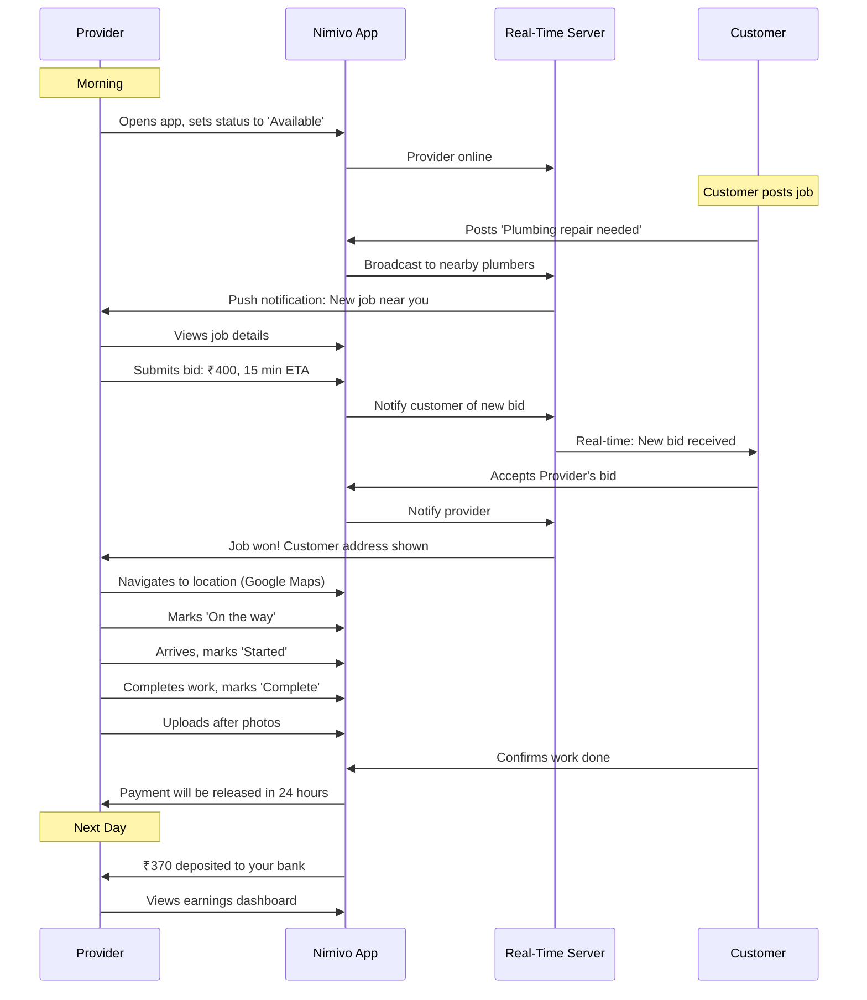

### 3. Provider Portfolio Building

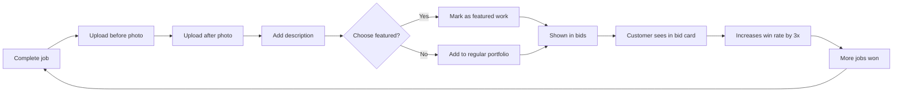

---

## System Architecture Diagrams

### 1. High-Level System Architecture

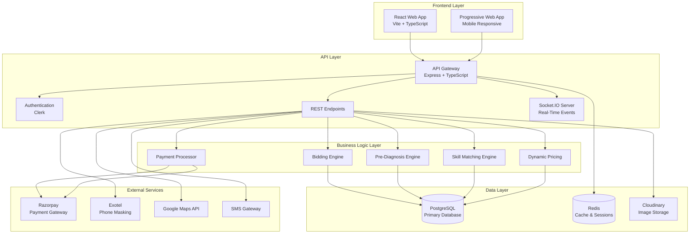

### 2. Database Entity Relationship Diagram

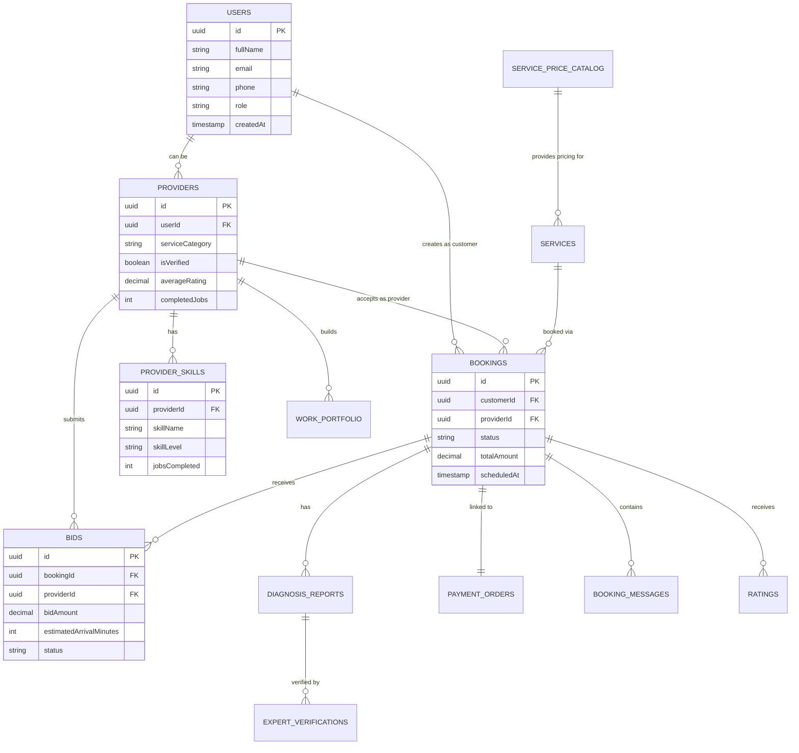

### 3. Real-Time Event Flow

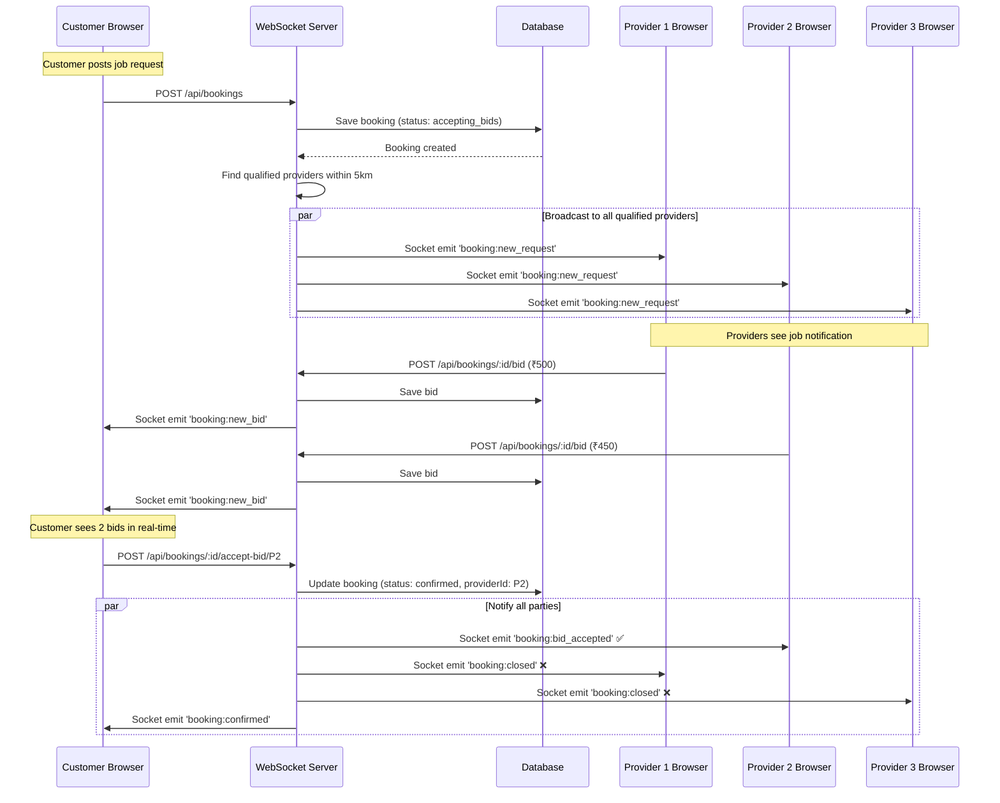

---

## Payment & Financial Flows

### 1. Complete Payment Lifecycle

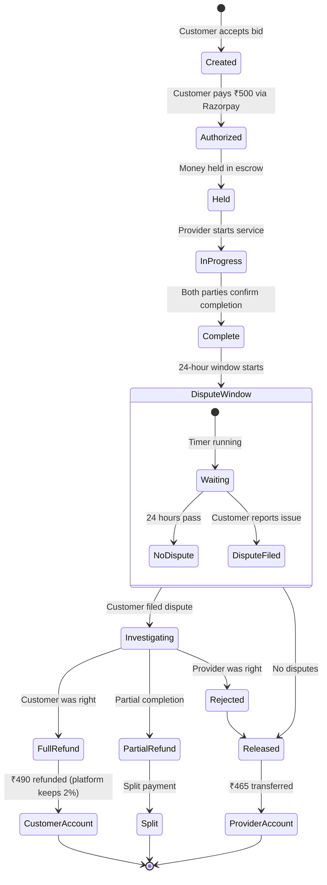

### 2. Revenue Split Breakdown

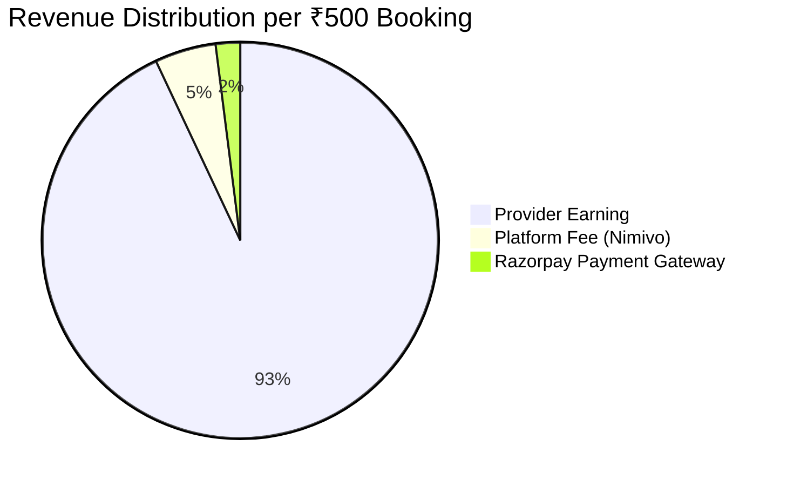

### 3. Subscription vs Pay-Per-Lead Model

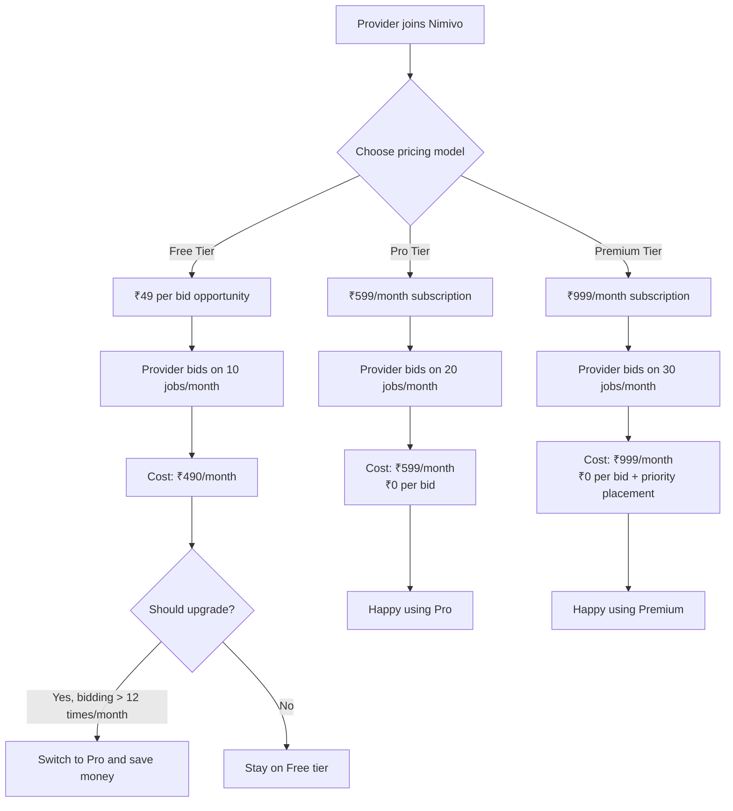

---

## Trust & Safety Workflows

### 1. Photo Diagnosis Verification Flow

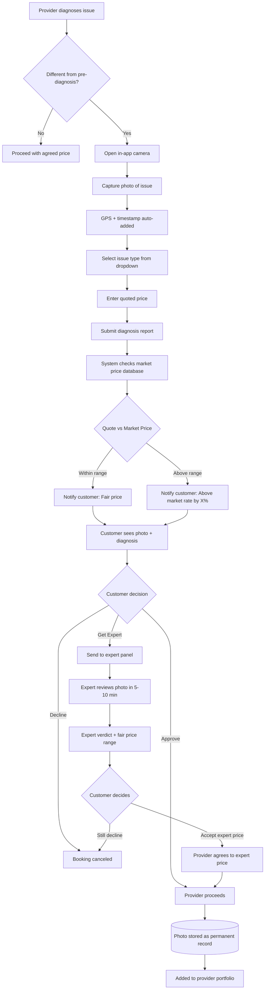

### 2. Identity Verification Process

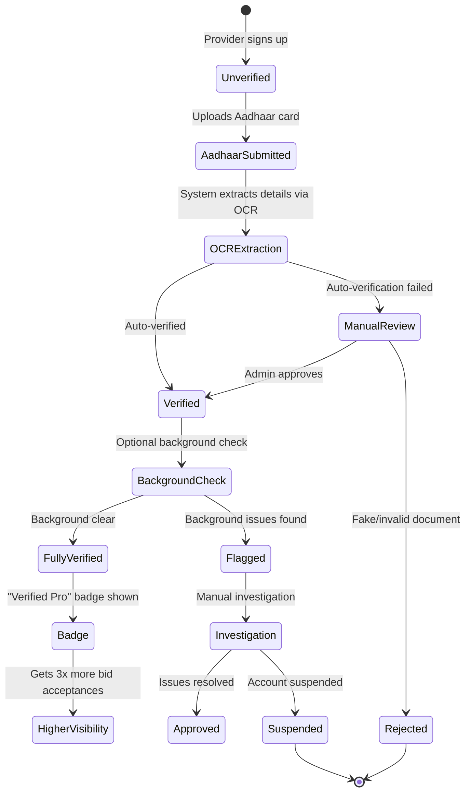

### 3. Dispute Resolution Workflow

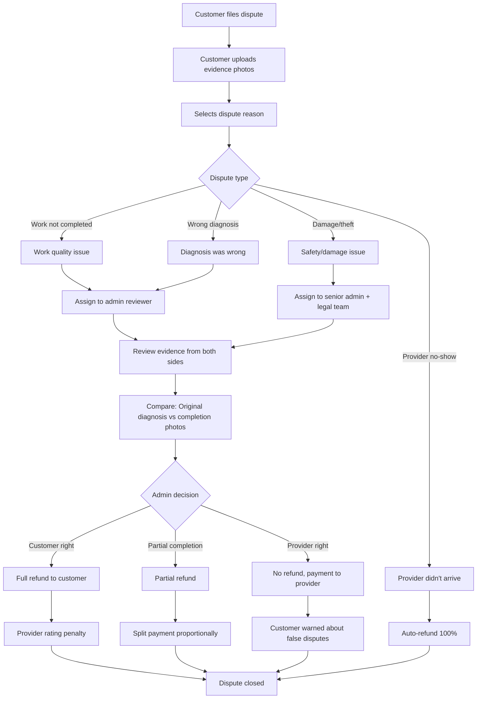

---

## Real-Time Communication Flows

### 1. In-App Chat System

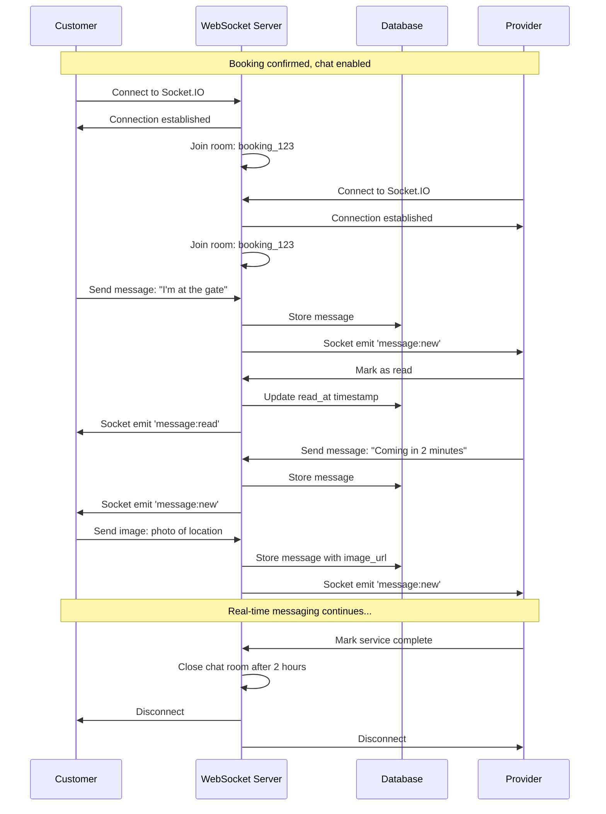

### 2. Live Tracking System

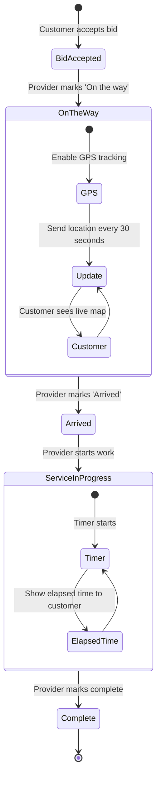

### 3. Push Notification Strategy

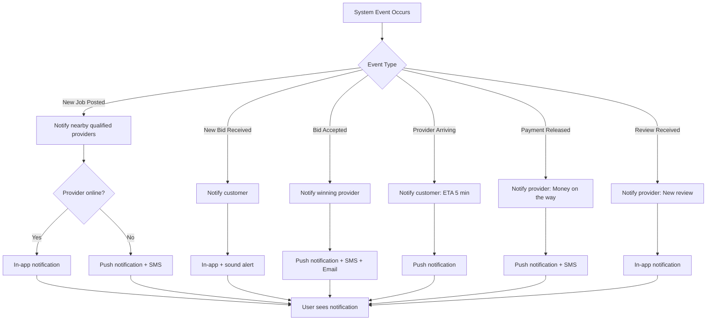

---

## Additional Specialized Workflows

### 1. SOS Emergency Mode Activation

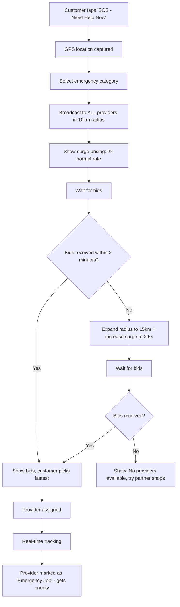

### 2. Recurring Booking Automation

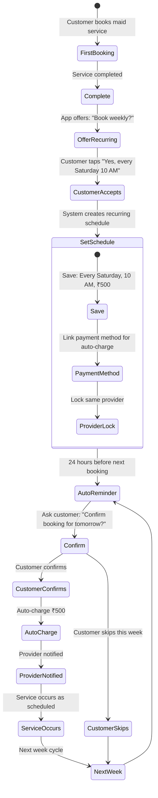

### 3. Provider Skill Verification Test Flow

```mermaid
flowchart TD
    Start[Provider wants 'Expert Verified' badge] --> Apply[Applies for skill verification]
    Apply --> Category[Select skill: 'AC Capacitor Replacement']
    Category --> Quiz[Take expert-designed quiz]
    
    Quiz --> Q1[Question 1: How to identify blown capacitor?]
    Q1 --> Q2[Question 2: Safety precautions?]
    Q2 --> Q3[Question 3: Testing with multimeter?]
    Q3 --> Q4[Question 4: Common mistakes?]
    Q4 --> Q5[Question 5: Price estimation factors?]
    
    Q5 --> Score{Quiz Score}
    
    Score -->|< 60%| Fail[Failed - can retake in 7 days]
    Score -->|60-79%| Pass[Passed - 'Verified' badge]
    Score -->|80-100%| Expert[Passed - 'Expert Verified' badge]
    
    Pass --> Benefit1[Shown in skill-based matching]
    Expert --> Benefit2[Shown in skill-based matching + priority placement]
    
    Benefit1 --> Earnings1[Earn 10% more per job]
    Benefit2 --> Earnings2[Earn 20% more per job]
    
    Fail --> Retry[Study materials provided]
    Retry --> Start
```

---

## Summary: Key Workflow Priorities

### Week 1-2 (Must Build)
1. ✅ Complete Booking Flow
2. ✅ Bidding System Event Flow
3. ✅ Payment Escrow Lifecycle

### Week 3-4 (Important)
4. ✅ Photo Diagnosis Verification
5. ✅ In-App Chat System
6. ✅ Provider Onboarding

### Week 5-6 (Enhancement)
7. ✅ Skill Verification
8. ✅ Live Tracking
9. ✅ Recurring Bookings

**All diagrams are implementation-ready. Use this document as your visual spec.**

---

**END OF WORKFLOW DIAGRAMS**
