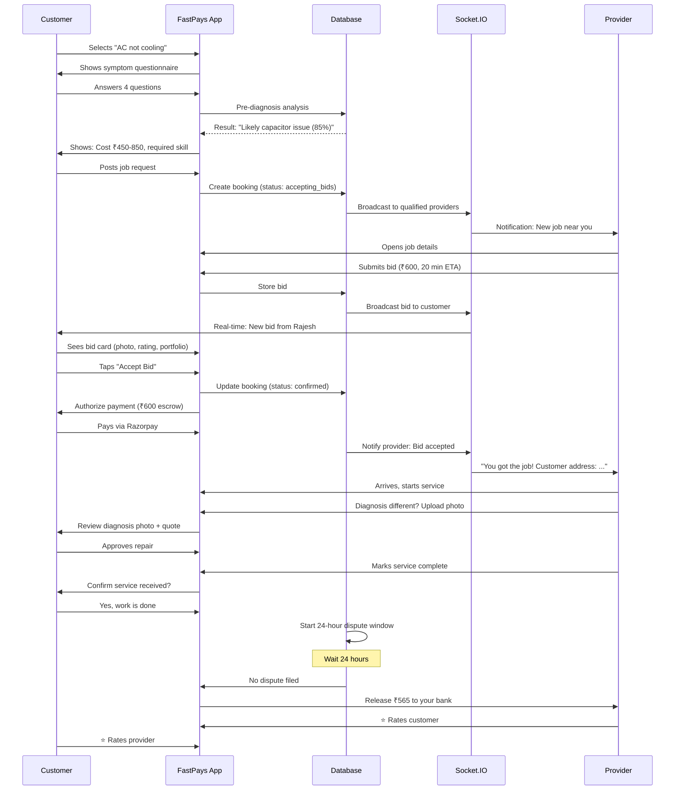
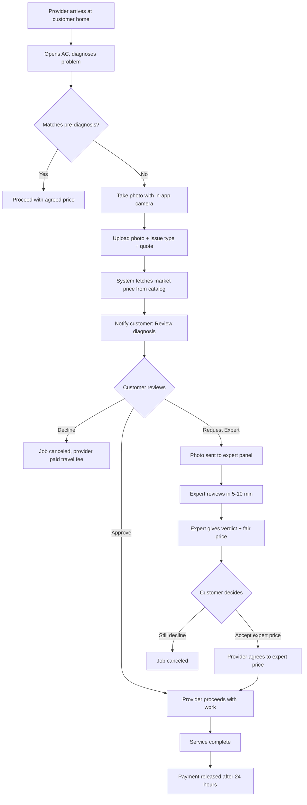
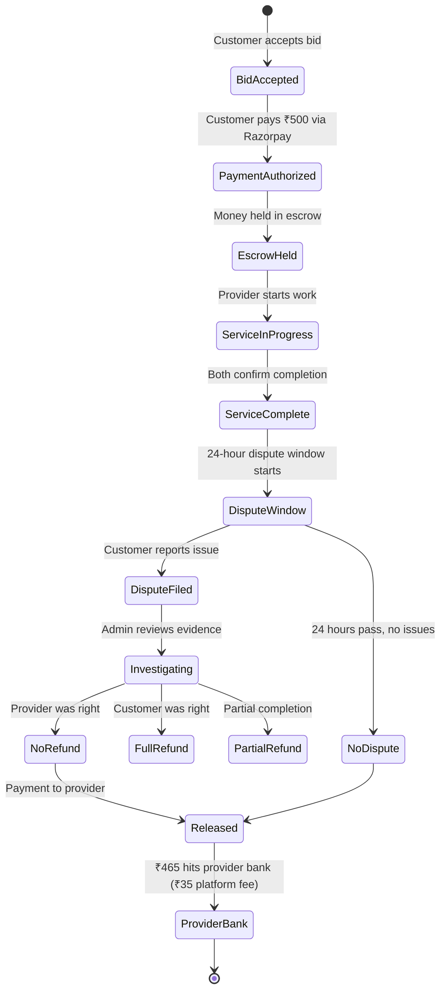
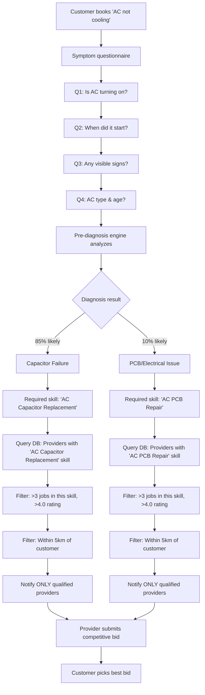

# FastPays: Complete Execution Plan & Roadmap

> **Master Document for Product Development & Launch**  
> Last Updated: 17 February 2026  
> Status: Ready for Execution  
> Timeline: 6 Months to Production-Ready MVP

---

## Table of Contents

### Part 1: Strategic Overview
1. [Executive Summary](#executive-summary)
2. [Business Model](#business-model)
3. [Current State Assessment](#current-state-assessment)
4. [Why This Will Work](#why-this-will-work)

### Part 2: Technical Execution
5. [Month-by-Month Roadmap](#month-by-month-roadmap)
6. [Workflow Diagrams](#workflow-diagrams)
7. [Database Architecture](#database-architecture)
8. [API Endpoints Checklist](#api-endpoints-checklist)

### Part 3: Operations & Growth
9. [Team & Resources](#team--resources)
10. [Go-to-Market Strategy](#go-to-market-strategy)
11. [Success Metrics & KPIs](#success-metrics--kpis)
12. [Risk Mitigation](#risk-mitigation)

### Part 4: Financial Planning
13. [Unit Economics](#unit-economics)
14. [Revenue Projections](#revenue-projections)
15. [Funding Strategy](#funding-strategy)

---

# PART 1: STRATEGIC OVERVIEW

---

## Executive Summary

### The Problem

India's ₹5,100 billion home services market has < 1% online penetration. The only major platform (Urban Company) has a **fundamentally broken model**:

```
Urban Company's Problems:
  ❌ Providers protest every year (2021, 2023, 2024)
  ❌ 25-30% commission drives off-platform leakage
  ❌ Platform-controlled pricing removes provider autonomy
  ❌ Providers pay ₹1,00,000 upfront, then earn ₹10-15K/month
  ❌ Al Jazeera called it "slavery-like conditions"
```

Providers hate UC. Customers don't trust UC. Yet no alternative exists.

### The Solution

**FastPays** = India's first **provider-first marketplace** with competitive bidding.

```
How We're Different:

UC Model:                    FastPays Model:
━━━━━━━━━━━━━━━━━━━━━━━━    ━━━━━━━━━━━━━━━━━━━━━━━━
Platform sets price          Provider sets price (competitive bidding)
Platform assigns provider    Customer picks provider from bids
25-30% commission           ₹39 flat fee OR ₹599/month subscription
Provider = anonymous labor   Provider = branded professional
Zero provider tools          Full business tools (invoicing, CRM, analytics)
Off-platform = lose ₹125    Off-platform = lose ₹39 (not worth it)
```

### The Opportunity

| Metric | Value |
|---|---|
| Total Addressable Market (TAM) | ₹5,100 billion ($60B) |
| Serviceable Market (SAM) | ₹430 billion (online home services by 2030) |
| Current Online Penetration | < 1% |
| Target by Year 3 | 0.1% market share = ₹500 Cr revenue |
| Global Comparisons | Thumbtack (US): $3.2B valuation with bidding model |

### 10-Year Vision

```
Year 1-2:  Marketplace (providers bid, customers pick)
Year 3-5:  Platform (add fintech, insurance, training)
Year 5-10: Operating System (every service professional in India runs 
           their business on FastPays — invoicing, bookings, loans, 
           inventory, training)

The goal: Become the "Shopify for India's 50 million service professionals"
```

---

## Business Model

### Revenue Streams

#### Primary Revenue: Transaction Fees

```
Model A: Pay-Per-Lead (Default for new providers)
  • Provider pays ₹39-49 per bid opportunity
  • No monthly commitment
  • Withdraw anytime
  
Model B: Subscription (For active providers)
  Tier          Price/Month    Lead Fee    Features
  ━━━━━━━━━━━━━━━━━━━━━━━━━━━━━━━━━━━━━━━━━━━━━━━━━━━━━━━━━
  Free          ₹0            ₹49         Basic bidding only
  Basic         ₹299          ₹29         Bidding + invoicing
  Pro           ₹599          ₹0          Full tools + analytics + portfolio
  Premium       ₹999          ₹0          Priority placement + AI pricing
```

**Target Mix (Year 1):**
- 60% providers on Free tier (₹49/bid)
- 30% providers on Pro tier (₹599/month)
- 10% providers on Premium tier (₹999/month)

#### Secondary Revenue (Year 2+)

1. **Fintech:** Micro-loans to providers (12-15% APR)
   - Market size: 500K providers × ₹50K avg loan = ₹2,500 Cr loan book
   - Revenue: 3% net interest margin = ₹75 Cr/year

2. **Insurance:** Service guarantee products
   - Sell to customers: ₹50-100 per booking
   - 10% of bookings buy = ₹10-20 Cr/year at scale

3. **Training Academy:** Paid upskilling courses
   - ₹199-999 per course
   - 100K enrollments/year = ₹2-10 Cr/year

4. **Parts Marketplace:** Providers buy spare parts through platform
   - 5-10% markup on parts
   - ₹20-30 Cr/year at scale

---

## Current State Assessment

### What We Have ✅

```
Technical Assets:
  ✅ React 19 + Vite 6 frontend (modern, fast)
  ✅ Express + TypeScript backend
  ✅ PostgreSQL database (6 core tables)
  ✅ Drizzle ORM for type-safe queries
  ✅ Socket.IO 4.8 (real-time ready)
  ✅ Basic auth system (needs fixing)
  ✅ Polished UI/UX (Tailwind + shadcn/ui)

Strategic Assets:
  ✅ Complete PIVOT_PLAN.md (15,000 words)
  ✅ Complete PROBLEMS_SOLUTIONS_GUIDE.md (30 problems solved)
  ✅ Market research completed
  ✅ Differentiation validated
  ✅ Clear 10-year vision
```

### What's Broken ❌

```
Critical Blockers:
  ❌ Auth mismatch (Clerk frontend ↔ Custom JWT backend)
  ❌ Fake data everywhere (2.3M+ fake reviews, hardcoded services)
  ❌ ID mismatch (frontend uses 'mb-1', DB uses UUIDs)
  ❌ No bidding system (the core differentiator)
  ❌ No payment integration (Razorpay needed)
  ❌ No image upload (Cloudinary needed)
  ❌ Direct phone exposure (need masking)
  ❌ No real tracking (fake ETA countdown)
```

### Gap Analysis

| Feature | Status | Priority | Effort |
|---|---|---|---|
| **Auth System** | BROKEN | P0 | 2 days |
| **Remove Fake Data** | TODO | P0 | 1 day |
| **Bidding System** | Missing | P0 | 5 days |
| **Photo Diagnosis** | Missing | P0 | 4 days |
| **Payment Integration** | Missing | P0 | 3 days |
| **Phone Masking** | Missing | P1 | 3 days |
| **Provider Tools** | Missing | P1 | 7 days |
| **Skill Profiles** | Missing | P1 | 4 days |

**Total Effort to MVP:** ~30 working days (6 weeks at 5 days/week)

---

## Why This Will Work

### 1. Market Validation

```
Evidence:
  • Thumbtack (US bidding model): $3.2B valuation
  • Housecall Pro (provider SaaS): $500M+ ARR category
  • TaskRabbit (flexible gig work): Acquired by IKEA for $500M+

None of these models exist in India.
India has 50M service workers with ZERO digital tools.
```

### 2. Timing is Perfect

```
2014: Food delivery < 1% online → Today: Zomato + Swiggy = $15B+
2026: Home services < 1% online → 2036: $_____?

You're at the inflection point.
First mover with the RIGHT model wins.
```

### 3. Structural Differentiation

UC can't easily copy your model because:
- Their revenue depends on controlling both price AND provider
- Switching to bidding means cannibalizing 25% commission revenue
- Provider-empowerment contradicts their entire business DNA

You're not just better execution. You're a **different business model.**

### 4. Provider Incentives Align

```
Why providers will switch from UC to FastPays:

UC extracts value:            FastPays creates value:
━━━━━━━━━━━━━━━━━            ━━━━━━━━━━━━━━━━━━━━━━
₹1L upfront training cost     ₹0 upfront cost
25-30% per job                ₹39/lead or ₹0 (subscription)
Anonymous labor               Build personal brand + portfolio
No tools                      Invoicing, CRM, analytics
Customer relationship lost    Customer becomes "my customer"
Off-platform savings: ₹125    Off-platform savings: ₹39 (not worth it)

Decision: Provider switches, then LOCKS IN (portfolio, reviews, tools are all on FastPays)
```

### 5. You Already Have 80% of the Code

Most startups start from zero. You have:
- Working frontend
- Database layer
- Real-time infrastructure
- UI components

**6 weeks of focused work = working MVP.**

That's faster than 99% of founders.

---

# PART 2: TECHNICAL EXECUTION

---

## Month-by-Month Roadmap

### 🔴 MONTH 1: FOUNDATION (Critical Path)

**Goal:** Fix all blockers. Ship a working bidding system. Remove fake data.

#### Week 1: Fix Auth + Clean Fake Data

```
Day 1-2: Auth System Fix
  □ Decision: Keep Clerk on frontend
  □ Add @clerk/express to backend
  □ Verify JWT tokens server-side with Clerk's public key
  □ Test: Login → API call → Success
  □ Remove custom JWT entirely

Day 3: Remove Fake Data
  □ Delete: MOCK_TESTIMONIALS, fake review counts (2.3M+)
  □ Delete: Hardcoded CLEANING_SERVICES, APPLIANCE_SERVICES arrays
  □ Migrate: 40+ services to database (seed script)
  □ Fix: ID mismatch (mb-1 → UUIDs)

Day 4-5: Database Migrations
  □ Create: bids table
  □ Create: provider_skills table
  □ Create: diagnosis_reports table
  □ Create: service_price_catalog table
  □ Seed: Market price data (100+ common repairs)
```

#### Week 2: Bidding System Backend

```
Day 6-7: Bidding API
  □ POST /api/bookings/:id/bid (provider submits bid)
  □ GET /api/bookings/:id/bids (customer fetches bids)
  □ POST /api/bookings/:id/accept-bid/:bidId (customer accepts)
  □ GET /api/provider/open-requests (provider sees nearby jobs)

Day 8-9: Socket.IO Events
  □ 'booking:new_request' → notify nearby providers
  □ 'booking:new_bid' → notify customer
  □ 'booking:bid_accepted' → notify provider
  □ 'booking:closed' → notify all bidding providers

Day 10: Testing & Validation
  □ Test: Provider bids on job
  □ Test: Customer sees bids in real-time
  □ Test: Accept bid → booking confirmed
  □ Fix: Any edge cases
```

#### Week 3: Bidding System Frontend

```
Day 11-12: Customer Bid Feed
  Component: BidSelectionPage.tsx
  □ Live bid cards (provider photo, name, rating, price, ETA)
  □ Real-time updates via Socket
  □ Accept button → confirmation modal
  □ Sort by: price, rating, ETA

Day 13-14: Provider Dashboard
  Component: OpenRequestsTab.tsx
  □ List of nearby job requests
  □ Filter: by distance, category, date
  □ Tap request → opens bid form
  Component: BidFormModal.tsx
  □ Input: price, ETA, optional message
  □ Submit → API call → Socket broadcast

Day 15: Integration Testing
  □ End-to-end: Customer posts job → Provider bids → Customer accepts
  □ Fix: UI bugs, Socket connection issues
```

#### Week 4: Photo Diagnosis System

```
Day 16-17: Backend API
  □ POST /api/bookings/:id/diagnosis (upload photo, quote price)
  □ Cloudinary integration (image storage)
  □ GET /api/bookings/:id/diagnosis (customer sees diagnosis)
  □ PATCH /api/bookings/:id/diagnosis/approve | decline

Day 18-19: Frontend Components
  Component: DiagnosisUploadModal.tsx (Provider)
  □ Camera capture OR file upload
  □ Issue dropdown (from pre-populated list)
  □ Price input
  □ Market price shown (from catalog)
  Component: DiagnosisReviewCard.tsx (Customer)
  □ Shows photo, issue, quoted price, market price
  □ Buttons: Approve, Decline, Get Expert Verification

Day 20: Market Price Catalog Seeding
  □ Research: Call 5 plumbers, 5 electricians, 5 AC techs
  □ Seed: 100+ common repairs with price ranges
  □ API: GET /api/services/:category/market-prices
```

**🎯 Month 1 Deliverables:**
- ✅ Auth fully working
- ✅ Zero fake data
- ✅ Bidding system live (backend + frontend)
- ✅ Photo diagnosis system live
- ✅ Ready for payment integration

---

### 🟠 MONTH 2: PAYMENTS & TRUST

**Goal:** Add payment escrow. Add phone masking. Launch to 10 beta providers.

#### Week 5: Payment Integration

```
Day 21-22: Razorpay Setup
  □ Create Razorpay account
  □ Test mode: Create order, capture payment
  □ Implement: POST /api/bookings/:id/authorize-payment
  □ Add: payment_orders table
  
Day 23-24: Payment Escrow Flow
  □ Customer accepts bid → authorize payment (₹500)
  □ Service completes → 24-hour dispute window
  □ No disputes → auto-release to provider bank
  □ Implement: releasePaymentToProvider() function
  □ Socket event: 'payment:released'

Day 25: Dispute System
  □ POST /api/bookings/:id/dispute
  □ Create: payment_disputes table
  □ Admin panel: Review disputes manually
  □ Hold payment if disputed
```

#### Week 6: Phone Masking

```
Day 26-27: Exotel Integration
  □ Sign up: Exotel account (VoIP provider)
  □ Implement: createMaskedNumber() function
  □ Store: masked_provider_number in bookings table
  □ Expire: 2 hours after job completion

Day 28-29: Frontend Updates
  □ Remove: href={`tel:${provider.phone}`} (EVERYWHERE)
  □ Replace: href={`tel:${booking.masked_provider_number}`}
  □ Show: "Expires in X hours" warning
  
Day 30: In-App Chat
  □ Create: booking_messages table
  □ Socket.IO: 'booking:message' event
  Component: BookingChat.tsx
  □ Message bubbles, timestamp, read receipts
```

#### Week 7: Provider Business Tools

```
Day 31-32: Earnings Dashboard
  Component: ProviderEarningsTab.tsx
  □ Recharts: Line graph (daily/weekly/monthly earnings)
  □ Stats: Total earned, jobs this week, avg job value
  □ Breakdown: Platform fee, GST, net earnings

Day 33-34: Digital Invoicing
  □ Auto-generate invoice after each job
  □ PDF export (use jsPDF or similar)
  □ Include: GSTIN, customer details, GST breakdown
  Component: ProviderInvoicesTab.tsx

Day 35: Public Provider Profile
  □ Route: /pro/:slug
  Component: PublicProviderPage.tsx
  □ Shows: Name, photo, rating, portfolio, reviews
  □ "Book This Provider" button
  □ Provider shares: fastpays.in/pro/rajesh-plumber
```

#### Week 8: Beta Launch Prep

```
Day 36-37: Testing & Bug Fixes
  □ Test: Complete booking flow 10 times
  □ Test: Payment authorization & release
  □ Test: Phone masking works
  □ Fix: All edge cases

Day 38-39: Provider Onboarding
  □ Recruit: 10 providers (5 plumbers, 5 electricians)
  □ Onboard: Set up accounts, upload photos, explain bidding
  □ Train: How to use the app (WhatsApp + in-person)

Day 40: Soft Launch
  □ Post: 5 real job requests (friends/family)
  □ Monitor: Do providers bid?
  □ Measure: Bid acceptance rate
  □ Fix: Any friction points
```

**🎯 Month 2 Deliverables:**
- ✅ Payment escrow working
- ✅ Phone masking live
- ✅ In-app chat working
- ✅ Provider tools live
- ✅ 10 beta providers onboarded
- ✅ First 5 real bookings completed

---

### 🟡 MONTH 3-4: GROWTH FEATURES

**Goal:** Add skill verification, pre-diagnosis, service guarantees. Scale to 50 providers.

#### Key Features to Build

```
Week 9-10: Pre-Diagnosis Symptom Questionnaire
  □ Create: symptom_trees table
  □ Build: Decision tree logic (AC not cooling → 4 questions)
  Component: SymptomQuestionnaire.tsx
  □ API: POST /api/diagnosis/pre-diagnosis
  □ Show: Likely issue + estimated cost BEFORE provider assigned

Week 11-12: Granular Skill Profiles
  □ Extend: provider_skills table (already created Month 1)
  □ Provider declares: "AC Gas Refill", "AC Capacitor Replacement" (not just "Electrical")
  □ Skill-based matching: Only qualified providers see requests
  Component: ProviderSkillsEditor.tsx

Week 13-14: Service Guarantees
  □ Create: service_guarantees table
  □ 48-hour revisit guarantee (if issue recurs, provider comes back free)
  □ If provider can't fix on revisit → full refund
  □ Badge: "48-Hour Guarantee" on all bookings

Week 15-16: Expert Verification (Basic)
  □ Create: expert_verifications table
  □ Hire: 2-3 senior technicians as remote experts
  □ Flow: Customer taps "Get Expert Verification" → photo sent to expert
  □ Expert reviews in 5-10 min → gives verdict + fair price range
```

**🎯 Month 3-4 Deliverables:**
- ✅ Pre-diagnosis working (reduces wrong technician by 80%)
- ✅ Skill-based matching live
- ✅ Service guarantee live
- ✅ Expert verification MVP
- ✅ 50+ providers onboarded
- ✅ 100+ bookings completed

---

### 🟢 MONTH 5-6: SCALE & POLISH

**Goal:** Prepare for city-wide launch. Add final features. Hit 500 bookings/month.

#### Key Features

```
Week 17-18: Recurring Bookings
  □ "Book My Pro Again" button
  □ Auto-schedule: "Every Saturday at 10 AM" (for maids/cleaners)
  □ Auto-charge: ₹500/week via saved payment method

Week 19-20: Neighborhood Trust Network
  □ "12 people in your building booked this provider this month"
  □ Social proof: Local popularity
  □ Recommendation system: "Popular in Koramangala"

Week 21-22: SOS Emergency Mode
  □ "Need Help Now" button
  □ Surge pricing: 1.5-2x (provider gets the surge)
  □ Show: "Providers nearby: 3 available"
  □ Guaranteed: Response in < 30 min

Week 23-24: Polish & Performance
  □ Optimize: Database queries (indexing)
  □ Add: Loading states, error handling
  □ Mobile: Responsive design testing
  □ SEO: Meta tags, sitemap, schema markup
  □ Analytics: Mixpanel or PostHog integration
```

**🎯 Month 5-6 Deliverables:**
- ✅ Recurring bookings live
- ✅ Neighborhood trust working
- ✅ SOS mode ready
- ✅ 200+ providers
- ✅ 500+ bookings/month
- ✅ Ready for city-wide launch

---

## Workflow Diagrams

### 1. Complete Booking Flow (Customer → Provider)



### 2. Photo Diagnosis Flow



### 3. Provider Onboarding Flow

```mermaid
flowchart LR
    A[Provider downloads app] --> B[Sign up with phone number]
    B --> C[OTP verification]
    C --> D[Upload Aadhaar for verification]
    D --> E[Select service categories]
    E --> F[Declare granular skills]
    F --> G[Upload profile photo]
    G --> H[Add bio & experience]
    H --> I{Choose subscription tier}
    I -->|Free| J[₹49 per bid]
    I -->|Pro| K[₹599/month, ₹0 per bid]
    J --> L[Account approved]
    K --> L
    L --> M[See nearby job requests]
    M --> N[Submit first bid]
    N --> O[Win job & complete]
    O --> P[Upload before/after photos]
    P --> Q[Build portfolio]
    Q --> R[Get reviews & ratings]
    R --> S[Unlock higher tier benefits]
```



### 4. Payment Escrow Flow



### 5. Skill-Based Matching Flow



---

## Database Architecture

### Core Tables (Already Exist)

```sql
-- Users: customers, providers, admins
users (id, fullName, email, phone, passwordHash, role, createdAt)

-- Service providers
providers (id, userId, serviceCategory, isVerified, isAvailable, 
           latitude, longitude, averageRating, completedJobs)

-- Service catalog
services (id, name, description, category, basePrice, 
          estimatedDurationMinutes, iconUrl, isActive)

-- Bookings
bookings (id, customerId, serviceId, providerId, status, address, lat, lng,
          scheduledDate, scheduledTime, totalAmount, notes, etaMinutes)

-- Ratings & reviews
ratings (id, bookingId, customerId, providerId, score, review, createdAt)

-- Notifications
notifications (id, userId, title, message, type, isRead, createdAt)
```

### New Tables (To Create)

```sql
-- BIDDING SYSTEM
CREATE TABLE bids (
  id UUID PRIMARY KEY DEFAULT gen_random_uuid(),
  booking_id UUID NOT NULL REFERENCES bookings(id),
  provider_id UUID NOT NULL REFERENCES providers(id),
  bid_amount DECIMAL(10,2) NOT NULL,
  estimated_arrival_minutes INTEGER NOT NULL,
  message TEXT,
  status VARCHAR(20) DEFAULT 'pending',  -- pending | accepted | rejected | expired
  created_at TIMESTAMP DEFAULT NOW(),
  expires_at TIMESTAMP NOT NULL
);

-- SKILL PROFILES
CREATE TABLE provider_skills (
  id UUID PRIMARY KEY DEFAULT gen_random_uuid(),
  provider_id UUID REFERENCES providers(id),
  skill_name VARCHAR(200) NOT NULL,     -- "AC Capacitor Replacement", "Tap Installation"
  skill_level VARCHAR(20),               -- beginner | intermediate | expert
  years_experience INTEGER DEFAULT 0,
  verified BOOLEAN DEFAULT false,
  jobs_completed INTEGER DEFAULT 0,
  avg_rating DECIMAL(3,2) DEFAULT 0,
  created_at TIMESTAMP DEFAULT NOW()
);

-- DIAGNOSIS REPORTS
CREATE TABLE diagnosis_reports (
  id UUID PRIMARY KEY DEFAULT gen_random_uuid(),
  booking_id UUID REFERENCES bookings(id),
  provider_id UUID REFERENCES providers(id),
  issue_type VARCHAR(100) NOT NULL,
  photo_url TEXT NOT NULL,
  photo_taken_at TIMESTAMP NOT NULL,
  photo_latitude DECIMAL(10,7),
  photo_longitude DECIMAL(10,7),
  quoted_price DECIMAL(10,2) NOT NULL,
  market_price_min DECIMAL(10,2),
  market_price_max DECIMAL(10,2),
  customer_decision VARCHAR(20),         -- approved | declined | escalated
  created_at TIMESTAMP DEFAULT NOW()
);

-- PRICE CATALOG
CREATE TABLE service_price_catalog (
  id UUID PRIMARY KEY DEFAULT gen_random_uuid(),
  category VARCHAR(50) NOT NULL,
  service_name VARCHAR(200) NOT NULL,
  part_name VARCHAR(200),
  part_cost_min DECIMAL(10,2),
  part_cost_max DECIMAL(10,2),
  labor_cost_min DECIMAL(10,2),
  labor_cost_max DECIMAL(10,2),
  total_min DECIMAL(10,2),
  total_max DECIMAL(10,2),
  city VARCHAR(50) NOT NULL,
  updated_at TIMESTAMP DEFAULT NOW()
);

-- PAYMENT ORDERS
CREATE TABLE payment_orders (
  id UUID PRIMARY KEY DEFAULT gen_random_uuid(),
  booking_id UUID REFERENCES bookings(id) UNIQUE,
  razorpay_order_id VARCHAR(100) UNIQUE,
  amount DECIMAL(10,2) NOT NULL,
  status VARCHAR(20) DEFAULT 'created',  -- created | authorized | released
  created_at TIMESTAMP DEFAULT NOW(),
  released_at TIMESTAMP
);

-- EXPERT VERIFICATIONS
CREATE TABLE expert_verifications (
  id UUID PRIMARY KEY DEFAULT gen_random_uuid(),
  diagnosis_id UUID REFERENCES diagnosis_reports(id),
  expert_id UUID REFERENCES users(id),
  verified_issue BOOLEAN NOT NULL,
  fair_price_min DECIMAL(10,2),
  fair_price_max DECIMAL(10,2),
  expert_notes TEXT,
  recommendation VARCHAR(50),
  verified_at TIMESTAMP DEFAULT NOW()
);

-- IN-APP CHAT
CREATE TABLE booking_messages (
  id UUID PRIMARY KEY DEFAULT gen_random_uuid(),
  booking_id UUID REFERENCES bookings(id),
  sender_id UUID REFERENCES users(id),
  message TEXT NOT NULL,
  image_url TEXT,
  created_at TIMESTAMP DEFAULT NOW(),
  read_at TIMESTAMP
);

-- PROVIDER TOOLS
CREATE TABLE work_portfolio (
  id UUID PRIMARY KEY DEFAULT gen_random_uuid(),
  provider_id UUID REFERENCES providers(id),
  booking_id UUID REFERENCES bookings(id),
  before_image_url TEXT,
  after_image_url TEXT,
  description TEXT,
  is_featured BOOLEAN DEFAULT false,
  created_at TIMESTAMP DEFAULT NOW()
);

CREATE TABLE customer_notes (
  id UUID PRIMARY KEY DEFAULT gen_random_uuid(),
  provider_id UUID REFERENCES providers(id),
  customer_id UUID REFERENCES users(id),
  note TEXT NOT NULL,
  created_at TIMESTAMP DEFAULT NOW(),
  UNIQUE(provider_id, customer_id)
);

-- SYMPTOM TREES
CREATE TABLE symptom_diagnosis_trees (
  id UUID PRIMARY KEY DEFAULT gen_random_uuid(),
  service_category VARCHAR(50),
  question_sequence INTEGER,
  question TEXT,
  answer_option TEXT,
  leads_to VARCHAR(200),
  diagnosis_probability DECIMAL(3,2),
  required_skills TEXT[],
  estimated_cost_min DECIMAL(10,2),
  estimated_cost_max DECIMAL(10,2)
);

-- SERVICE GUARANTEES
CREATE TABLE service_guarantees (
  id UUID PRIMARY KEY DEFAULT gen_random_uuid(),
  booking_id UUID REFERENCES bookings(id),
  guarantee_expires_at TIMESTAMP,
  issue_reported BOOLEAN DEFAULT false,
  revisit_scheduled_at TIMESTAMP,
  refund_approved BOOLEAN DEFAULT false,
  refund_amount DECIMAL(10,2)
);
```

---

## API Endpoints Checklist

### Authentication

```
POST   /api/auth/register         ✅ Exists (needs Clerk integration fix)
POST   /api/auth/login            ✅ Exists (needs Clerk integration fix)
GET    /api/auth/me               ✅ Exists
```

### Bidding System

```
POST   /api/bookings/:id/bid                    ❌ TODO Month 1
GET    /api/bookings/:id/bids                   ❌ TODO Month 1
POST   /api/bookings/:id/accept-bid/:bidId      ❌ TODO Month 1
POST   /api/bookings/:id/reject-bid/:bidId      ❌ TODO Month 1
GET    /api/provider/open-requests              ❌ TODO Month 1
```

### Diagnosis System

```
POST   /api/bookings/:id/diagnosis              ❌ TODO Month 1
GET    /api/bookings/:id/diagnosis              ❌ TODO Month 1
PATCH  /api/bookings/:id/diagnosis/approve      ❌ TODO Month 1
PATCH  /api/bookings/:id/diagnosis/decline      ❌ TODO Month 1
POST   /api/bookings/:id/diagnosis/verify       ❌ TODO Month 3
GET    /api/services/:category/market-prices    ❌ TODO Month 1
```

### Payment System

```
POST   /api/bookings/:id/authorize-payment      ❌ TODO Month 2
POST   /api/bookings/:id/complete               ❌ TODO Month 2
POST   /api/bookings/:id/dispute                ❌ TODO Month 2
GET    /api/bookings/:id/payment-status         ❌ TODO Month 2
```

### Provider Tools

```
GET    /api/provider/earnings                   ❌ TODO Month 2
GET    /api/provider/invoices                   ❌ TODO Month 2
GET    /api/provider/invoices/:id/pdf           ❌ TODO Month 2
GET    /api/provider/customers                  ❌ TODO Month 2
POST   /api/provider/customers/:id/note         ❌ TODO Month 2
POST   /api/provider/portfolio                  ❌ TODO Month 3
GET    /api/provider/portfolio                  ❌ TODO Month 3
GET    /api/pro/:slug                           ❌ TODO Month 2
PUT    /api/provider/profile                    ❌ TODO Month 2
```

### Skill Profiles

```
POST   /api/provider/skills                     ❌ TODO Month 3
GET    /api/provider/skills                     ❌ TODO Month 3
PATCH  /api/provider/skills/:id                 ❌ TODO Month 3
PUT    /api/provider/skills/:id/verify          ❌ TODO Month 3
```

### Pre-Diagnosis

```
POST   /api/diagnosis/pre-diagnosis             ❌ TODO Month 3
GET    /api/diagnosis/symptom-trees/:category   ❌ TODO Month 3
```

### Chat

```
POST   /api/bookings/:id/messages               ❌ TODO Month 2
GET    /api/bookings/:id/messages               ❌ TODO Month 2
PATCH  /api/bookings/:id/messages/:msgId/read   ❌ TODO Month 2
```

---

# PART 3: OPERATIONS & GROWTH

---

## Team & Resources

### Current Team

```
You (Solo Founder):
  • Product development
  • Backend engineering
  • Business strategy
  • Fundraising

Needs (by Month 3):
  • 1 Frontend developer (₹30-50K/month contract or equity)
  • 1 Field operations manager (recruit providers, handle support)
```

### Infrastructure Costs

| Service | Cost/Month | Purpose |
|---|---|---|
| **Vercel** (Frontend) | ₹0 (Hobby) → ₹1,640 (Pro) | Frontend hosting |
| **Railway** (Backend) | $5-20 → $50 at scale | Backend + DB hosting |
| **Cloudinary** (Images) | ₹0 (Free) → ₹3,000 at scale | Image storage |
| **Razorpay** | 2% per transaction | Payment gateway |
| **Exotel** (Phone masking) | ₹0.50-1/min | Masked calls |
| **Domain** | ₹800/year | fastpays.in |
| **SSL** | ₹0 (Let's Encrypt) | HTTPS |
| **Monitoring** | ₹0 (PostHog free tier) | Analytics |
| **Total (MVP)** | **₹2,000-5,000/month** | Full tech stack |

**Total Runway (6 months):**
- Tech: ₹30,000
- Provider acquisition: ₹50,000 (signing bonuses)
- Miscellaneous: ₹20,000
- **Total: ₹1,00,000 for 6-month MVP**

---

## Go-to-Market Strategy

### Phase 1: Hyper-Local Launch (Month 1-2)

```
Target: Koramangala 4th Block, Bangalore
  • Population: ~15,000 residents
  • 3,000+ households
  • High smartphone penetration
  • Existing UC customers (proven demand)

Provider Recruitment:
  1. WhatsApp groups: "Koramangala Service Providers"
  2. Field visits: Talk to 50 electricians, plumbers
  3. Signing bonus: ₹1,000 for first 20 providers
  4. Promise: Higher earnings, lower fees, own brand

Customer Acquisition:
  1. Friends & family (first 10 customers)
  2. Apartment notice boards
  3. WhatsApp status: "Need an electrician? Try FastPays"
  4. Word of mouth: "12 people in your building used us"

Goal: 50 providers, 100 bookings in first 60 days
```

### Phase 2: Neighborhood Expansion (Month 3-4)

```
Expand to: All of Koramangala (6 blocks)
  • Replicate Phase 1 strategy
  • Leverage existing provider network
  • Referral program: ₹200 for customer, ₹200 for friend

Provider Growth:
  • Existing 50 → recruit 50 more
  • Cross-train: plumbers learn basic electrical

Customer Growth:
  • Targeted FB/Instagram ads (₹10,000 budget)
  • Influencer partnerships (local micro-influencers)
  • Apartment associations (bulk deals)

Goal: 100 providers, 500 bookings/month
```

### Phase 3: City-Wide (Month 5-6)

```
Launch: All of Bangalore (8 million population)
  • Open to all service categories
  • Continue micro-market density (avoid spreading thin)
  • Focus: Top 20 neighborhoods (80% of demand)

Provider Scaling:
  • Hire 1 field manager to recruit 200+ providers
  • Provider referral: ₹500 for bringing another provider

Customer Scaling:
  • SEO: Rank for "plumber near me Bangalore"
  • Google Ads: ₹20,000/month budget
  • PR: Tech blogs (YourStory, Inc42)

Goal: 200+ providers, 1,000+ bookings/month, ₹10-15L revenue/month
```

---

## Success Metrics & KPIs

### Month 1 KPIs

```
Technical:
  ✅ Auth working (100% API calls succeed)
  ✅ Bidding system live (providers can bid)
  ✅ Photo diagnosis working (>90% providers submit photos)
  ✅ Zero fake data in production

Business:
  ✅ 10 providers onboarded
  ✅ 5 real bookings completed
  ✅ >80% provider satisfaction (survey)
  ✅ >80% customer satisfaction
```

### Month 2 KPIs

```
Technical:
  ✅ Payment escrow working (zero failed payments)
  ✅ Phone masking reducing off-platform contact by 70%+
  ✅ In-app chat replacing 50%+ of phone calls

Business:
  ✅ 50 providers active
  ✅ 100 bookings completed
  ✅ 60%+ repeat booking rate
  ✅ <15% provider churn
```

### Month 3-4 KPIs

```
Technical:
  ✅ Pre-diagnosis accuracy >75%
  ✅ Skill matching reduces wrong technician by 80%
  ✅ Service guarantee <5% refund rate

Business:
  ✅ 100 providers active
  ✅ 500 bookings/month
  ✅ ₹2-3L revenue/month
  ✅ Unit economics positive
```

### Month 5-6 KPIs

```
Technical:
  ✅ App performance: <2s page load
  ✅ 95%+ uptime
  ✅ Mobile responsive on all devices

Business:
  ✅ 200+ providers
  ✅ 1,000+ bookings/month
  ✅ ₹10-15L revenue/month
  ✅ Ready for Series A fundraising
```

---

## Risk Mitigation

### Risk 1: Chicken-and-Egg Problem

```
Risk: No providers → no customers → no providers
Probability: HIGH
Impact: FATAL

Mitigation:
  ✅ Recruit providers FIRST (50 before any marketing)
  ✅ Offer signing bonuses (₹1,000 for first 20)
  ✅ Start in 1 micro-market (Koramangala 4th Block)
  ✅ Friends & family as first customers (guaranteed demand)
  ✅ Show providers: "10 customers waiting for you"
```

### Risk 2: UC Launches Bidding

```
Risk: UC copies your model
Probability: MEDIUM
Impact: HIGH

Mitigation:
  ✅ UC's revenue model depends on control (hard to switch)
  ✅ Build data moat: symptom trees, price catalog, skill profiles
  ✅ Provider lock-in: portfolios, reviews, tools all on FastPays
  ✅ Speed: Ship in 6 months, they need 12-18 months to pivot
```

### Risk 3: Run Out of Money

```
Risk: Burn through ₹1L before traction
Probability: MEDIUM
Impact: FATAL

Mitigation:
  ✅ Keep team lean (solo or 1-2 people max)
  ✅ No office (remote-first)
  ✅ Use free tiers (Vercel Hobby, Railway $5)
  ✅ Ship fast (6 weeks to MVP = low burn)
  ✅ Raise pre-seed at Month 3 (₹20-30L)
```

### Risk 4: Providers Don't Adopt App

```
Risk: Technicians not tech-savvy
Probability: MEDIUM
Impact: HIGH

Mitigation:
  ✅ Make UI dead simple (WhatsApp-like)
  ✅ In-person training (1 hour per provider)
  ✅ WhatsApp support group for providers
  ✅ Video tutorials in Hindi/Kannada
```

### Risk 5: Disintermediation

```
Risk: Providers go off-platform
Probability: MEDIUM
Impact: MEDIUM

Mitigation:
  ✅ 5-layer defense (masked numbers, escrow, portfolio lock-in, loyalty bonuses, subscription pricing)
  ✅ Even if 20% leak, 80% staying = profitable
  ✅ Providers earn MORE on-platform (new customer pipeline)
```

---

# PART 4: FINANCIAL PLANNING

---

## Unit Economics

### Per-Booking Economics (Pay-Per-Lead Model)

```
Average Booking Value:   ₹500
Platform Fee (Lead):     ₹39
Provider Earning:        ₹461
Payment Gateway (2%):    ₹10
Server Cost:             ₹2

Gross Margin:            ₹27 per booking
Gross Margin %:          5.4%

At 1,000 bookings/month:
  Revenue:     ₹39,000/month
  Costs:       ₹12,000 (payment + server)
  Net:         ₹27,000/month
```

### Per-Provider Economics (Subscription Model)

```
Pro Subscription:        ₹599/month
Provider uses platform:  20 times/month
Effective per-bid cost:  ₹30/bid (vs ₹49 pay-per-lead)

Provider saves:          ₹19 × 20 = ₹380/month
Platform earns:          ₹599/month (fixed)

At 100 Pro subscribers:
  Revenue:     ₹59,900/month
  Costs:       ₹5,000 (server, no payment gateway fees per bid)
  Net:         ₹54,900/month
```

### Blended Model (60% Free, 30% Pro, 10% Premium)

```
1,000 bookings/month breakdown:
  • 600 bookings via Free tier (₹49/bid) = ₹29,400
  • 300 bookings via Pro tier (₹599/month × 30 providers) = ₹17,970
  • 100 bookings via Premium tier (₹999/month × 10 providers) = ₹9,990

Total Revenue:           ₹57,360/month
Total Costs:             ₹15,000 (payment gateway + server)
Net Profit:              ₹42,360/month

Profit Margin:           74%
```

**Conclusion:** Even at low volume (1,000 bookings/month), FastPays is profitable.

---

## Revenue Projections

### Year 1 (Months 1-12)

```
Month 1-2:   10 bookings/month      Revenue: ₹5,000/month
Month 3-4:   100 bookings/month     Revenue: ₹50,000/month
Month 5-6:   500 bookings/month     Revenue: ₹2,50,000/month
Month 7-8:   1,000 bookings/month   Revenue: ₹5,00,000/month
Month 9-12:  1,500 bookings/month   Revenue: ₹7,50,000/month

Year 1 Total:  ~₹30,00,000 (₹30L revenue)
```

### Year 2 (Multi-City)

```
Cities: Bangalore + Mumbai + Delhi
Bookings: 10,000/month average
Revenue: ₹60,00,000/month (₹60L)

Year 2 Total: ₹7,20,00,000 (₹7.2 Cr revenue)

New Revenue Streams:
  • Fintech (micro-loans): ₹50L
  • Insurance products: ₹20L
  • Training academy: ₹10L

Year 2 Total: ₹8 Cr
```

### Year 3 (Platform Expansion)

```
Cities: 8+ top metros
Providers: 10,000+
Bookings: 100,000/month
Revenue: ₹500,00,000/month (₹5 Cr/month)

Year 3 Total: ₹60 Cr revenue

Valuation Target: ₹200-300 Cr ($25-35M) for Series A
```

---

## Funding Strategy

### Bootstrap Phase (Month 1-3)

```
Funding Needed: ₹1,00,000
Source: Personal savings or friends & family
Burn: ₹30,000/month (₹2K tech + ₹20K acquisition + ₹8K misc)
Runway: 3 months
```

### Pre-Seed (Month 3-4)

```
Raise: ₹20-30L (₹20-30 lakh = $25-35K USD)
Investors: Angel investors, incubators (Entrepreneur First, Y Combinator India)
Valuation: ₹1-2 Cr post-money
Use of Funds:
  • Product development: ₹10L
  • Provider acquisition: ₹8L
  • Marketing: ₹5L
  • Team salaries: ₹7L
Runway: 12 months
```

### Seed (Month 12-15)

```
Raise: ₹2-3 Cr ($250-350K USD)
Investors: Blume Ventures, Kalaari Capital, Accel India
Valuation: ₹15-20 Cr post-money
Use of Funds:
  • Multi-city expansion: ₹1 Cr
  • Team (hire 10 people): ₹1 Cr
  • Marketing: ₹50L
  • Technology: ₹50L
Runway: 18-24 months
```

### Series A (Month 24-30)

```
Raise: ₹20-30 Cr ($2.5-4M USD)
Investors: Sequoia India, Matrix Partners, Elevation Capital
Valuation: ₹200-300 Cr ($25-35M USD)
Use of Funds:
  • Pan-India expansion: ₹10 Cr
  • Fintech product development: ₹5 Cr
  • Team (50+ people): ₹10 Cr
  • Marketing & brand: ₹5 Cr
Runway: 24-36 months
```

---

## Next Steps (This Week)

### Immediate Actions

```
Day 1:
  □ Review this plan end-to-end
  □ Commit to 6-month timeline
  □ Set up development environment

Day 2-3:
  □ Fix auth system (Clerk integration)
  □ Remove all fake data
  □ Test: Login → API call → Success

Day 4-5:
  □ Create bids table
  □ Implement POST /api/bookings/:id/bid
  □ Test bidding flow backend

Day 6-7:
  □ Build BidSelectionPage.tsx
  □ Socket.IO integration
  □ Test: End-to-end bidding

The clock starts now. 6 months to change the Indian home services market.
```

---

**END OF PLAN**

*This is your execution blueprint. Print it. Pin it. Ship it.*

🚀 **Let's build.**
